# Orientation independent Möbius CNNs
--------------------------------------------------------------------------------

<br/>
<p align="center">
    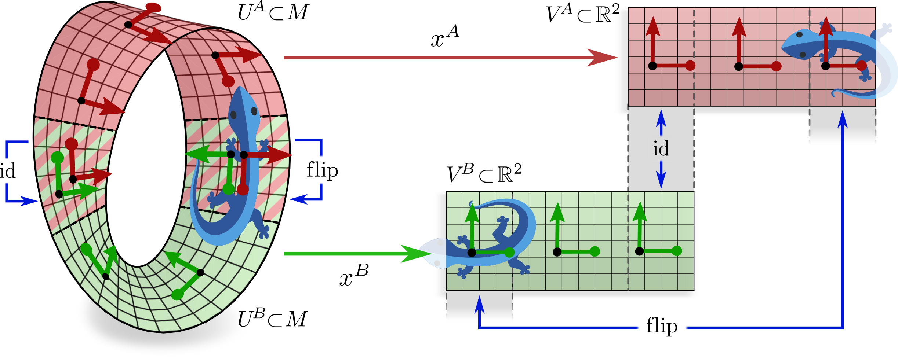
</p>
<br/>
<br/>

This repository implements and evaluates convolutional networks on the Möbius strip as toy model instantiations of
***[Coordinate Independent Convolutional Networks](https://arxiv.org/abs/2106.06020)***.


## Background (tl;dr)

All derivations and a detailed description of the models are found in Section 5 of our
***[paper](https://arxiv.org/abs/2106.06020)***.
What follows is an informal tl;dr, summarizing the central aspects of Möbius CNNs.


**Feature fields on the Möbius strip:**
A key characteristic of the Möbius strip is its topological twist, making it a
[_non-orientable_](https://en.wikipedia.org/wiki/Orientability) manifold.
Convolutional weight sharing on the Möbius strip is therefore only well defined up to a reflection of kernels.
To account for the ambiguity of kernel orientations, one needs to demand that the kernel responses (feature vectors) transform in a predictable way when different orientations are chosen.
Mathematically, this transformation is specified by a
[_group representation_](https://en.wikipedia.org/wiki/Group_representation)
ρ of the reflection group.
We implement three different feature field types, each characterized by a choice of group representation:
- _scalar fields_ are modeled by the _trivial representation_. Scalars stay invariant under reflective gauge transformations:
<p align="center">
    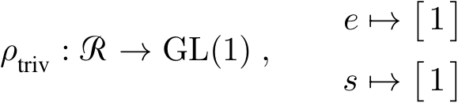
</p>

- _sign-flip fields_ transform according to the _sign-flip representation_ of the reflection group. Reflective gauge transformations negate the single numerical coefficient of a sign-flip feature:
<p align="center">
    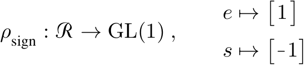
</p>

- _regular feature fields_ are associated to the _regular representation_. For the reflection group, this implies 2-dimensional features whose two values (channels) are swapped by gauge transformations:
<p align="center">
    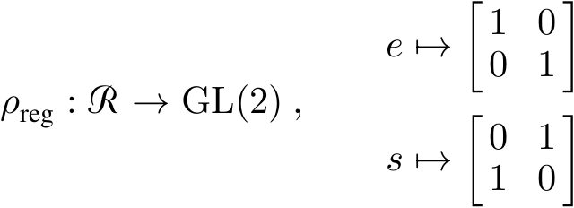
</p>


**Reflection steerable kernels (gauge equivariance):**

Convolution kernels on the Möbius strip are parameterized maps
<p align="center">
    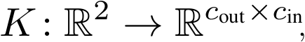
</p>

whose numbers of input and output channels depend on the types of feature fields between which they map.
Since a reflection of a kernel should result in a corresponding transformation of its output feature field, the kernel
has to obey certain symmetry constraints.
Specifically, kernels have to be _reflection steerable_ (or gauge equivariant), i.e. should satisfy:
<p align="center">
    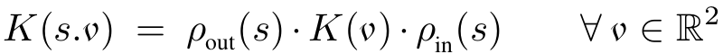
</p>

The following table visualizes this symmetry constraint for any pair of input and output field types that we implement:

<p align="center">
    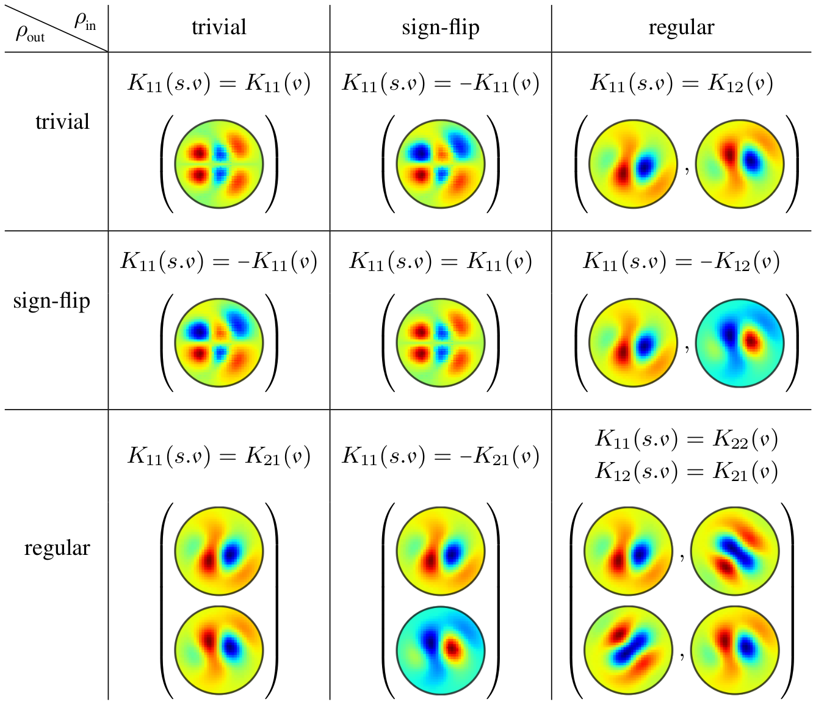
</p>
Similar equivariance constraints are imposed on biases and nonlinearities; see the paper for more
details.

<br/>
<br/>


**Isometry equivariance:**
Shifts of the Möbius strip along itself are isometries.
After one revolution (a shift by 2π), points on the strip do not return to themselves,
but end up reflected along the width of the strip:

<p align="center">
    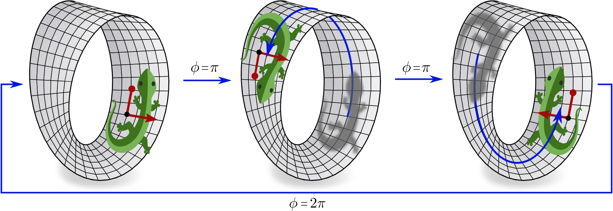
</p>

Such reflections of patterns are explained away by the reflection equivariance of the convolution
kernels.
Orientation independent convolutions are therefore automatically equivariant w.r.t. the action of such isometries on feature fields.
Our empirical results, shown in the table below, confirm that this theoretical guarantee holds in practice.
Conventional CNNs, on the other hand, are explicitly coordinate dependent, and are therefore in particular not isometry equivariant.


## Implementation

Neural network layers are implemented in [`nn_layers.py`](./nn_layers.py)
while the models are found in [`models.py`](./models.py).
All individual layers and all models are unit tested in [`unit_tests.py`](./unit_tests.py).


**Feature fields:**
We assume Möbius strips with a _locally flat geometry_, i.e. strips which can be thought of as being constructed by gluing two opposite ends of a rectangular flat stripe together in a twisted way.
Feature fields are therefore discretized on a regular sampling grid on a rectangular domain of
 pixels.
Note that this choice induces a global gauge (frame field), which is discontinuous at the cut.

In practice, a neural network operates on multiple feature fields which are stacked in the channel dimension (a direct sum).
Feature spaces are therefore characterized by their feature field multiplicities.
For instance, one could have 10 scalar fields, 4 sign-flip fields and 8 regular feature fields, which consume in total
 channels.
Denoting the batch size by
,
a feature space is encoded by a tensor of shape
.

The correct transformation law of the feature fields is guaranteed by the coordinate independence (steerability) of the network layers operating on it.


**Orientation independent convolutions and bias summation:**
The class `MobiusConv` implements orientation independent convolutions and bias summations between input and output feature spaces as specified by the multiplicity constructor arguments `in_fields` and `out_fields`, respectively.
Kernels are as usual discretized by a grid of `size`*`size` pixels.
The steerability constraints on convolution kernels and biases are implemented by allocating a reduced number of parameters, from which the symmetric (steerable) kernels and biases are expanded during the forward pass.

Coordinate independent convolutions rely furthermore on parallel transporters of feature vectors, which are implemented as a _transport padding_ operation.
This operation pads both sides of the cut with `size//2` columns of pixels which are 1) spatially reflected and 2) reflection-steered according to the field types.
The stripes are furthermore zero-padded along their width.

<p align="center">
    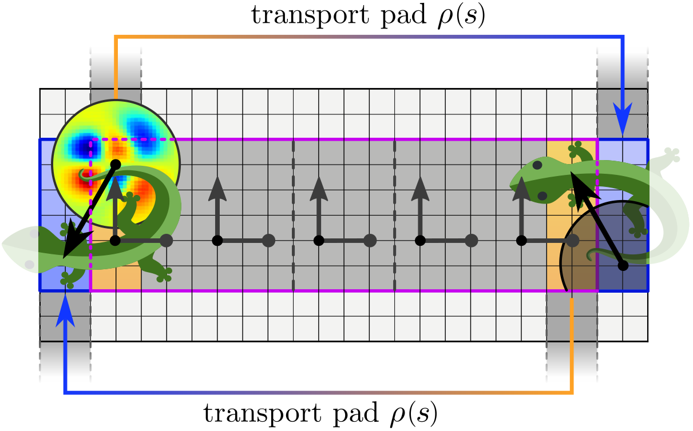
</p>

The forward pass operates then by:
- expanding steerable kernels and biases from their non-redundant parameter arrays
- transport padding the input field array
- running a conventional Euclidean convolution

As the padding added `size//2` pixels around the strip, the spatial resolution of the output field agrees with that of the input field.


**Orientation independent nonlinearities:**
Scalar fields and regular feature fields are acted on by conventional
[ELU nonlinearities](https://pytorch.org/docs/stable/nn.functional.html#elu),
which are equivariant for these field types.
Sign-flip fields are processed by applying ELU nonlinearities to their _absolute value_ after summing a learnable bias parameter.
To ensure that the resulting fields are again transforming according to the sign-flip representation, we multiply them subsequently with the signs of the input features.
See the paper and the class `EquivNonlin` for more details.


**Feature field pooling:**
The module `MobiusPool` implements an orientation independent pooling operation with a stride and kernel size of two pixels, thus halving the fields' spatial resolution.
Scalar and regular feature fields are pooled with a conventional max pooling operation, which is for these field types coordinate independent.
As the coefficients of sign-flip fields negate under gauge transformations, they are pooled based on their (gauge invariant) absolute value.

While the pooling operation is tested to be exactly gauge equivariant,
its spatial subsampling interferes _inevitably_ with its isometry equivariance.
Specifically, the pooling operation is only isometry equivariant w.r.t. shifts by an _even_ number of pixels.
Note that the same issue applies to conventional Euclidean CNNs as well; see e.g.
[(Azulay and Weiss, 2019)](https://arxiv.org/abs/1805.12177) or
[(Zhang, 2019)](https://arxiv.org/abs/1904.11486).


**Models:**
All models are implemented in
[`models.py`](./models.py).
The orientation independent models, which differ only in their field type multiplicities but agree in their total number of channels, are implemented as class `MobiusGaugeCNN`.
We furthermore implement conventional CNN baselines, one with the same number of channels and thus more parameters (α=1) and one with the same number of parameters but less channels (α=2).
Since conventional CNNs are explicitly coordinate dependent they utilize a naive padding operation (`MobiusPadNaive`), which performs a spatial reflection of feature maps but does not apply the unspecified gauge transformation.
The following table gives an overview of the different models:
<p align="center">
    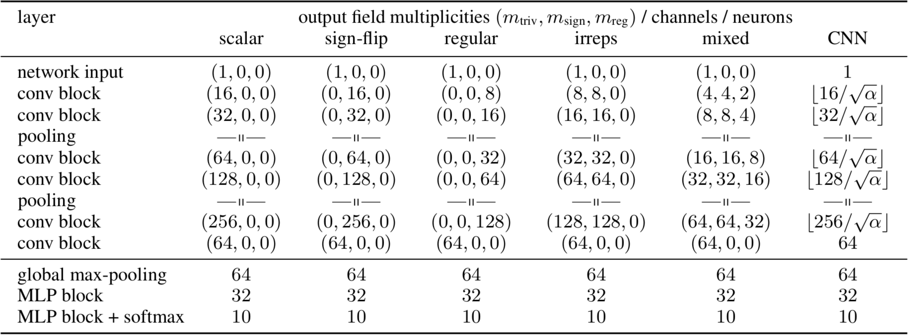
</p>


## Data - Möbius MNIST
We benchmark our models on Möbius MNIST, a simple classification dataset which consists of MNIST digits that are projected on the Möbius strip.
Since MNIST digits are gray-scale images, they are geometrically identified as _scalar fields_.
The size of the training set is by default set to 12000 digits, which agrees with the _rotated MNIST_ dataset.

There are two versions of the training and test sets which consist of _centered_ and _shifted_ digits.
All digits in the centered datasets occur at the same location (and the same orientation) of the strip.
The isometry shifted digits appear at uniformly sampled locations.
Recall that shifts once around the strip lead to a reflection of the digits as visualized above.
The following digits show isometry shifted digits (note the reflection at the cut):
<p align="center">
    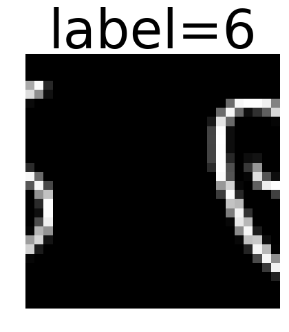 &emsp;
    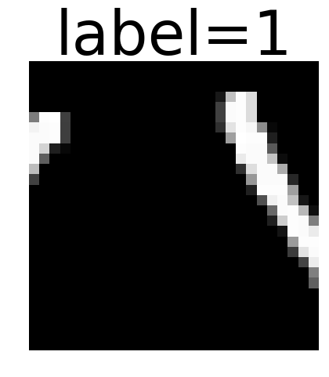 &emsp;
    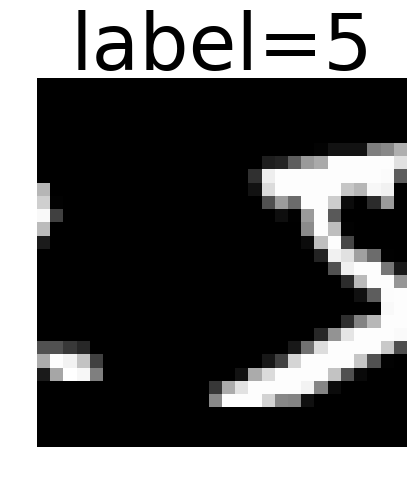 &emsp;
    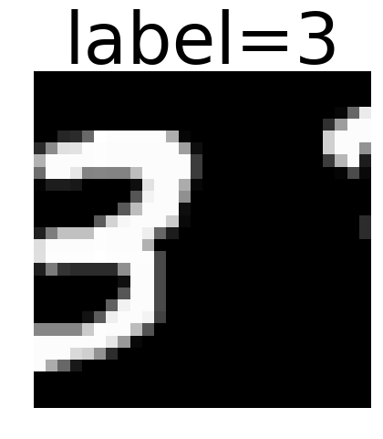 &emsp;
    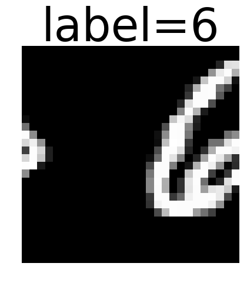 &emsp;
    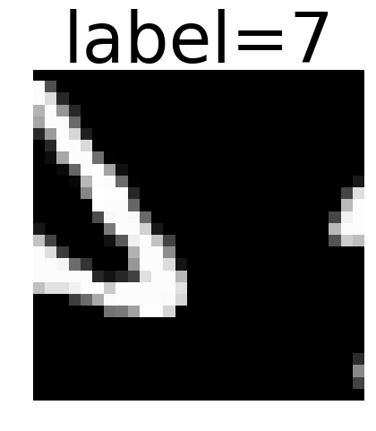 &emsp;
    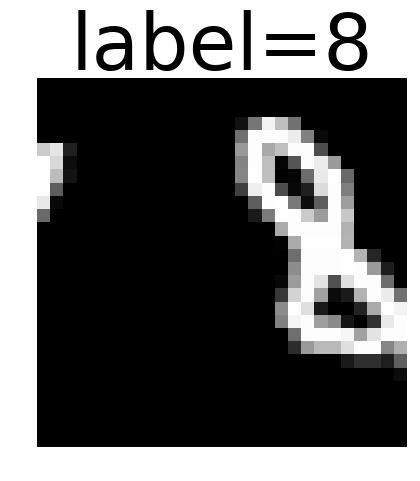 &emsp;
    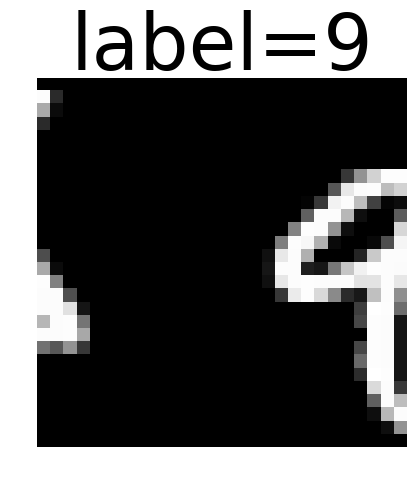 &emsp;
</p>

To generate the datasets it is sufficient to call `convert_mnist.py`,
which downloads the original MNIST dataset via `torchvision` and saves the Möbius MNIST datasets in `data/mobius_MNIST.npz`.


## Results

The models can then be trained by calling, for instance,
```
python train.py --model mobius_regular
```
For more options and further model types, consult the help message: `python train.py -h`

The following table gives an overview of the performance of all models in two different settings, averaged over 32 runs:
<p align="center">
    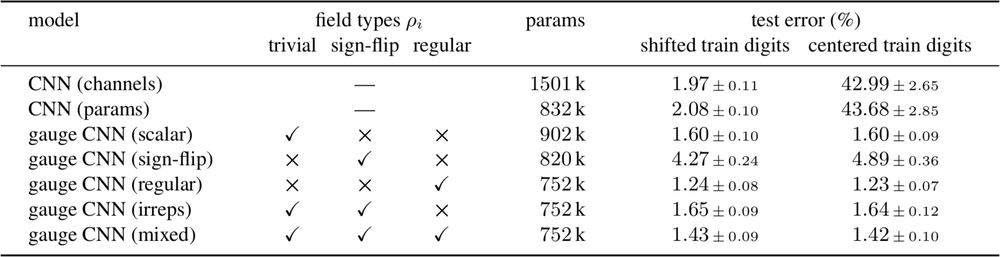
</p>

The setting "shifted train digits" trains and evaluates on isometry shifted digits.
To test the isometry equivariance of the models, we train them furthermore on "centered train digits", testing them then out-of-distribution on shifted digits.
As one can see, the orientation independent models generalize well over these unseen variations while the conventional coordinate dependent CNNs' performance deteriorates.


## Dependencies

This library is based on Python3.7.
It requires the following packages:
```
numpy
torch>=1.1
torchvision>=0.3
```
Logging via `tensorboard` is optional.
